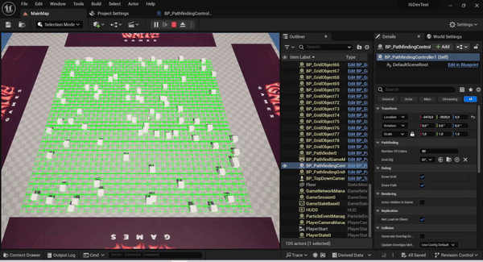

# Ignite Game Studio - Dev Unreal - Teste prático




### Video de demonstração


## Visão Geral

Este repositório contém a solução para um teste técnico de vaga para programador de gameplay. O objetivo é desenvolver um sistema de movimento para um personagem que simula a escalada em meshes estáticos em um ambiente 3D. O sistema foi projetado para permitir que o personagem controlado pelo jogador navegue dinamicamente ao redor de obstáculos, utilizando um algoritmo de pathfinding para garantir o caminho mais curto até o local clicado.

## Funcionalidades

### Funcionalidades Principais
- **Sistema Dinâmico de Pathfinding**: O personagem controlado pelo jogador se move até qualquer ponto clicado em um mesh estático. O sistema garante que obstáculos sejam evitados e que o personagem chegue ao destino pelo caminho mais curto.
- **Movimento Não-Linear**: O personagem pode se mover em qualquer direção, com base nos cliques do jogador, seja na horizontal, vertical ou diagonal.
- **Câmera Top-Down com Rotação de 90º**: A câmera oferece uma visão de cima do cenário, com a possibilidade de rotacionar lateralmente em incrementos de 90 graus, mantendo uma experiência suave de gameplay.
- **Detecção de Obstáculos**: Os meshes estáticos no ambiente atuam como obstáculos, e o personagem contorna inteligentemente esses objetos para alcançar o destino clicado.
- **Movimento Suave**: O personagem se move de forma fluida e evita sobreposições significativas de malha entre si e outros objetos durante a gameplay.

### Simplificações
- **Obstáculos Estáticos**: Todos os objetos no ambiente permanecem parados, o que significa que o sistema de pathfinding não precisa lidar com obstáculos móveis.
- **Acessibilidade Garantida**: O jogador só clicará em pontos alcançáveis, garantindo que o sistema de pathfinding não precise lidar com áreas inacessíveis.
- **Controles Suaves de Câmera**: A câmera é fixa em uma visão top-down, mas pode ser rotacionada lateralmente ao redor do pivô do personagem para melhor navegação e visibilidade.

## Detalhes Técnicos

### Sistema de Pathfinding
O sistema utiliza o algoritmo de pathfinding A* para calcular o caminho mais curto entre a localização atual do personagem e o ponto clicado. Ele considera quaisquer obstáculos (meshes estáticos) entre os pontos inicial e final e desvia deles conforme necessário.

#### Componentes Principais:
- **`APathfindingGrid`**: Representação da grade do ambiente. Cada nó da grade pode estar livre ou ocupado, e o sistema de pathfinding usa essa grade para calcular o movimento do personagem.
- **`APathfinder`**: Lógica principal de pathfinding responsável por encontrar o caminho mais curto usando o algoritmo A*. Ele calcula o caminho mais eficiente, evitando obstáculos.
- **`APathfindingController`**: O controlador principal que lida com eventos de entrada (como cliques do mouse) e aciona o sistema de pathfinding. Também gerencia o movimento do personagem ao longo do caminho calculado.
- **`AGridController`**: Esta classe lida com a entrada do jogador, seleciona os cubos, atualiza os caminhos e gerencia o movimento suave do personagem ao longo do caminho.

### Movimento do Personagem
O personagem inicia o jogo no modo "escalada", onde todo clique do mouse movimenta o personagem em direção ao mesh estático clicado. O personagem ajusta seu movimento dinamicamente com base nos obstáculos presentes no ambiente, garantindo uma travessia suave sem sobreposições significativas de malha.

### Sistema de Câmera
A câmera fornece uma visão top-down e pode ser rotacionada lateralmente em incrementos de 90 graus ao redor do pivô de yaw do personagem, permitindo que os jogadores ajustem sua visão para melhor navegação e visibilidade.

### Manipulação de Entrada
- **Clique com o Botão Esquerdo do Mouse**: O jogador clica em qualquer mesh estático, ativando o sistema de pathfinding para mover o personagem até o local clicado enquanto evita obstáculos.
- **Rotação da Câmera**: O jogador clica com o botão Direito, a câmera pode ser rotacionada lateralmente em incrementos de 90º ao redor do personagem para proporcionar uma melhor visibilidade de diferentes ângulos.

### Dependências
- **Unreal Engine 5**: O projeto foi desenvolvido utilizando Unreal Engine 5, aproveitando seu sistema de input aprimorado, mapeamento de entrada e física para pathfinding e movimento.
- **Enhanced Input**: O projeto utiliza o sistema Enhanced Input da Unreal para lidar com entradas do jogador, como cliques do mouse e rotação de câmera.

## Instalação

Para executar o projeto, siga os passos abaixo:

1. Clone o repositório:
    ```bash
    git clone https://github.com/muriloms/ignite-teste-unreal
    ```

2. Abra o projeto no **Unreal Engine 5**.

3. Construa e execute o projeto:
    - Certifique-se de que todas as dependências necessárias estão instaladas (por exemplo, Enhanced Input).
    - Compile o projeto e inicie a gameplay.

## Como Jogar

1. Inicie o jogo. O personagem controlado pelo jogador começará no modo "escalada".
2. Use o **Botão Esquerdo do Mouse** para clicar em qualquer mesh estático na cena. O personagem se moverá até o local clicado, evitando obstáculos.
3. Rode a câmera usando os controles de **Yaw Pivot** para ajustar a visão da cena.
4. Observe o personagem ajustando dinamicamente seu caminho para contornar obstáculos e chegar ao destino.

## Arquitetura de Código

### Classes Principais:
- **`AGridController`**: Lida com a entrada do jogador, atualização do pathfinding e lógica de movimento.
- **`APathfindingController`**: Gerencia a grade e os obstáculos, garantindo que nós bloqueados sejam marcados e que o pathfinding seja executado.
- **`APathfinder`**: Executa o algoritmo de pathfinding A*, calculando o caminho ótimo e desviando de obstáculos.
- **`APathfindingGrid`**: Representação baseada em grade do ambiente, utilizada pelo sistema de pathfinding para calcular rotas e detectar obstáculos.

### Fluxo de Código:
1. O jogador clica em um mesh estático usando o **Botão Esquerdo do Mouse**.
2. O `AGridController` processa a entrada e envia a localização para o `APathfinder`.
3. O `APathfinder` calcula o caminho ótimo usando o algoritmo A*.
4. O personagem se move ao longo do caminho até o local alvo.
5. Se um obstáculo for detectado, o sistema recalcula o caminho dinamicamente.


---

**Nota:** Este projeto foi desenvolvido como parte de um teste técnico para uma vaga de programador de gameplay. Ele demonstra experiência em **Unreal Engine** e **programação em C++** por meio da implementação de um sistema de pathfinding e movimento em um ambiente 3D.
